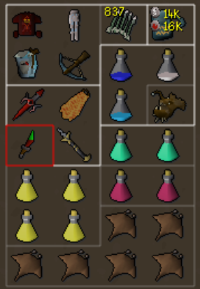
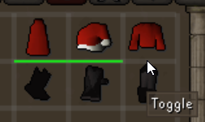
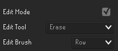
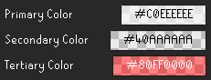

# Inventory Borders
RuneLite plugin for sorting your bank and inventory by dividing them into sections. 

## this is a work in progress!

As it currently stands, the mod only works with inventory and not bank.

I am planning compatibility with inventory setups, bank tags tabs, and bank tag layouts.  

There may be incompatibility with other plugins that modify the title text in the bank screen. If you know of one, let me know!

## Features

- enable edit mode to click where you want to draw a border

- select a variety of brushes and edit tools to modify large areas at once

- customize and use three different border colors at once
  

## Notes

The setups are only saved to your profile when you exit edit mode.  If you close the game before doing so, your most recent edits will be gone.

The main layout data is stored in the active profile, with the key ``inventoryborders.InventoryBorderStates``.  The string for each section is not easily editable, but they can be copied and applied to other profiles or sections. 

credit to /u/Springstof for inspiring this plugin with his well-designed bank:
https://old.reddit.com/r/2007scape/comments/yt7knw/ironman_bank_but_organized_using_weaponized_ocd/